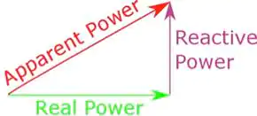
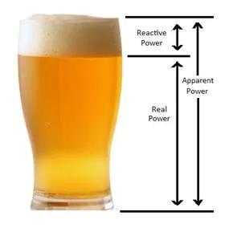
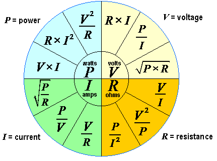

# Concept Definition

## 1. General

- Docs: https://www.nature.com/articles/sdata201637/tables/5

## 1. Electricity_???.csv

**Volt (V)**: 
- The unit of measurement of force used to produce an electric current.

**Current in Ampere (I)**:
- There is an electric charge going through the conductor. The electric current is compared to the water flow in the pipe and measured in amperes.

**Frequency (f)**:
- The amount of cycles in a second. It is measured in Hertz. If there is one cycle per second and 60 cycles per second, the frequencies are 1 and 60, respectively.

**Displacement Power Factor (DPF)**:
- The displacement power factor is the power factor due to the phase shift between voltage and current at the fundamental line frequency. For sinusoidal (non-distorted) currents, the displacement power factor is the same as the apparent power factor.

**Apparent Power Factor (APF)**:
- Power factor (PF) is the ratio of working power, measured in kilowatts (kW), to apparent power, measured in kilovolt amperes (kVA). Apparent power, also known as demand, is the measure of the amount of power used to run machinery and equipment during a certain period. It is found by multiplying (kVA = V x A). The result is expressed as kVA units.
  
**Real Power (P)**:
- The analogy is often made with the beer glass and the foam of the beer. You end up drinking the real power. The glass is the apparent power and must be big enough to hold the liquid and its foam. 
- The problem with reactive power is not only technical: it can have a considerable economic impact. The utility has to build a network that can carry the apparent power, charging only for the real power. Too great a difference would not be sustainable. The ratio of real power to apparent power is called the power factor. The power factor should be as close to "1" as possible. Electronic components, called power factor correctors are useful for this purpose. Countries often pass bills to increase the compliance of electronic devices with ever more stringent standards in order to obtain a good energy label.
- 
- 
- Docs: https://www.allaboutcircuits.com/textbook/alternating-current/chpt-11/true-reactive-and-apparent-power/

**Reactive Power (Q)**:
- The dissipated power resulting from inductive and capacitive loads measured in volt-amperes reactive (VAR).
- 
**Apparent Power (S)**:
- They get measured in volt-ampers (VA). Apparent power is equal to the RMS current and RMS voltage.

**Real Energy (Pt)**:
- Power and energy are closely related, but they are not interchangeable. Simply put, power is the rate at which work is done. While energy is the capacity to do work.
- Energy is the amount of power consumed over a period of time. It is measured in kilowatt hours.
  
**Reactive Energy (Qt)**:
- In the AC power industry, reactive energy is electrical energy that is stored rather than converted to some other form of energy and thus "used" or "consumed." Reactive power is the rate of transfer of reactive energy from one storage component to another.
  
**Apparent Energy (St)**:

### Omhs Law
